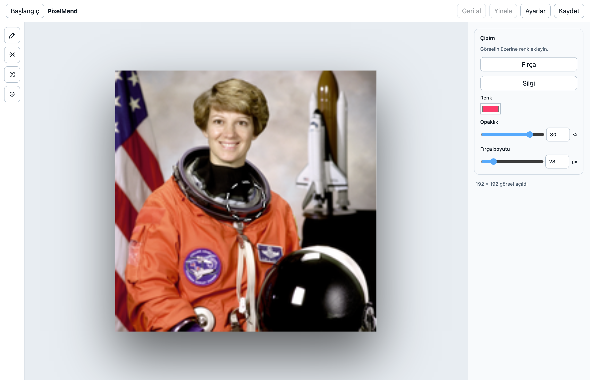
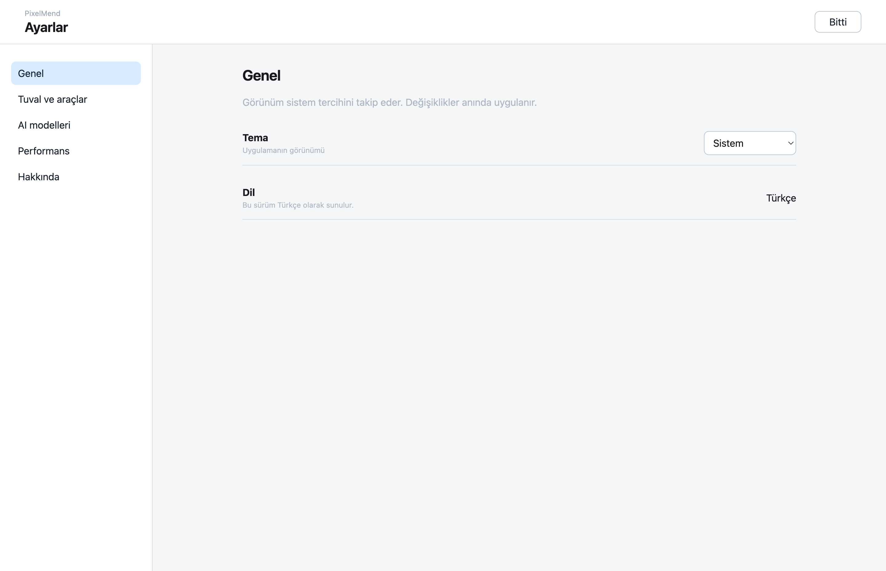

<h1 align="center">PixelMend</h1>

Repair, enlarge and edit your photos. On your own computer.

<strong>macOS · Apple Silicon · Local image processing · Development / RC</strong>

<a href="README.md">Türkçe</a> · English

PixelMend is a desktop application for selecting and removing unwanted areas, enlarging images and editing with brush tools. Photo processing runs in a local engine; photos are not sent to external services for editing. Model installation can require a separate download.

This repository is the public product showcase and feedback space. Application source code is not published here.

## From a photo to your next step

| Task | In PixelMend |
| --- | --- |
| Object removal | Brush selection; AI processing when its model is ready, or a separate Fast / OpenCV option |
| Enlargement | Standard / Lanczos and model-dependent AI enhancement; 2×, 4× or custom dimensions |
| Editing | Drawing, eraser, selection tools, undo / redo and zoom |
| Reviewing a result | Apply or discard a preview; continue editing from an accepted result |
| Saving work | PNG export and `.pixelmend` project files |
| Workspace | Turkish interface, light / dark / system themes and model status |

AI results depend on the photo and selection. Review the preview before saving; AI enlargement may reinterpret original details.

## Inside the application

These screenshots were captured from the running macOS application, rather than design mockups. The sample is a public-domain NASA photograph of Eileen Collins. [Capture and version record](docs/SCREENSHOTS.md).

| Start screen | Enlargement |
| --- | --- |
|  |  |

## Availability

PixelMend is in development. The installed application shown here is **1.0.0-rc.2**, captured on **2 October 2026**. The source project's status record dated 24 September 2026 lists advanced model acceptance, Windows / Linux testing on real devices and final release as unfinished work.

| Platform | Status |
| --- | --- |
| macOS / Apple Silicon | Local RC application; the platform shown in this gallery |
| Windows / Linux | Target platforms; not presented as generally available or accepted on real devices |
| Public download | No installer is published in this showcase repository |

The screenshots document the interface only. This repository does not present a new quality comparison, speed benchmark, evidence of GPU acceleration or a claim that every model is ready.

## Feedback

Submit a [bug report](https://github.com/Mahmutakin99/pixelmend-showcase/issues/new?template=bug-report.yml) or [feature request](https://github.com/Mahmutakin99/pixelmend-showcase/issues/new?template=feature-request.yml). Include the version, operating system, expected behavior and reproduction steps. Avoid posting private photos, personal file paths or sensitive diagnostic data in public issues.

Mahmut AKIN · [GitHub](https://github.com/Mahmutakin99)

## Rights and third-party materials

Original showcase text is covered by the [rights notice](RIGHTS.md). The source project's Apache-2.0 license, rights in inherited assets and third-party photo / model licenses remain separate and unchanged. Model weights and application binaries are not included in this repository.
