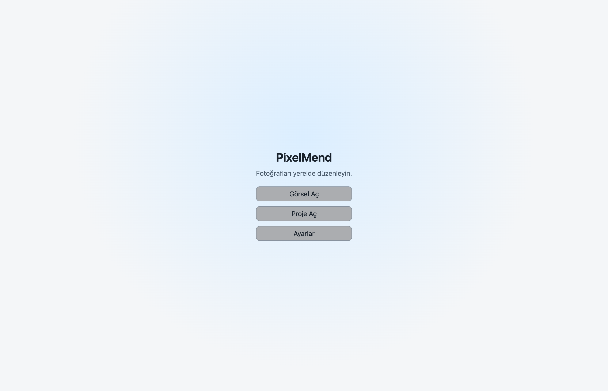
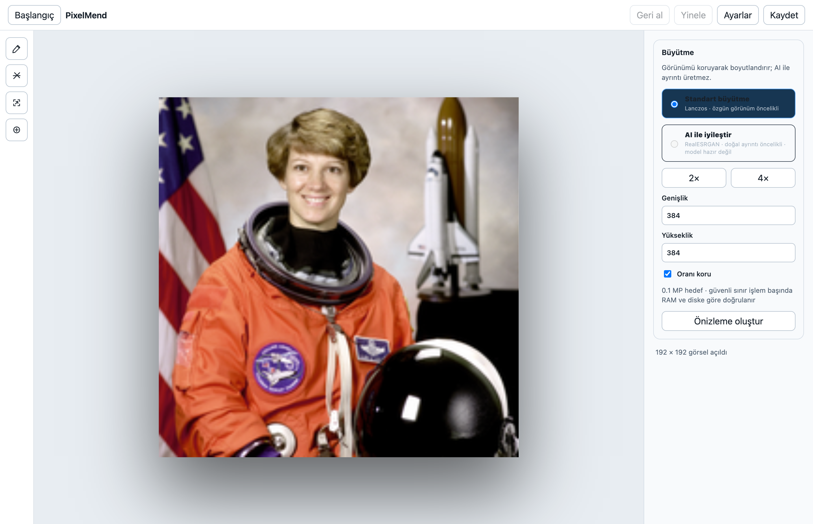

<h1 align="center">PixelMend</h1>

Repair, enlarge and edit your photos. On your own computer.

<strong>macOS Apple Silicon · Local image processing · Signed RC</strong>

<a href="https://github.com/Mahmutakin99/pixelmend/releases/tag/v1.0.0-rc.4">Download · 1.0.0-rc.4 · Mac</a>

<a href="README.md">Türkçe</a> · English

PixelMend is a desktop application for selecting and removing unwanted areas, enlarging images and editing with brush tools. Photo processing runs in a local engine; photos are not sent to external services for editing. Model installation can require a separate download.

This repository is the public product showcase and feedback space. Open source is hosted in the [PixelMend repository](https://github.com/Mahmutakin99/pixelmend); each download corresponds to its Release source tag.

## From a photo to your next step

| Task | In PixelMend |
| --- | --- |
| Object removal | Brush selection; AI processing when its model is ready, or a separate Fast / OpenCV option |
| Enlargement | Standard / Lanczos and model-dependent AI enhancement; 2×, 4× or custom dimensions |
| Editing | Drawing, eraser, selection tools, undo / redo and zoom |
| Reviewing a result | Apply or discard a preview; continue editing from an accepted result |
| Saving work | PNG export and `.pixelmend` project files |
| Workspace | Turkish interface, light / dark / system themes and model status |

AI results depend on the photo and selection. Review the preview before saving; AI enlargement may reinterpret original details.

## Inside the application

These screenshots were captured from the running macOS application, rather than design mockups. The sample is a public-domain NASA photograph of Eileen Collins. The gallery shows **1.0.0-rc.2**, captured on **2 October 2026**, not a new rc.4 quality or speed benchmark. Sample source: [scikit-image astronaut / NASA](https://raw.githubusercontent.com/scikit-image/scikit-image/v0.25.2/skimage/data/astronaut.png), [public-domain rights information](https://scikit-image.org/docs/0.25.x/api/skimage.data.html#skimage.data.astronaut). No endorsement by NASA or the person depicted is implied.

| Start screen | Enlargement |
| --- | --- |
|  |  |

## Availability

The current Mac release is **1.0.0-rc.4**, signed with Developer ID Application and notarized by Apple. It is a prerelease. Models are downloaded separately. Opening images, drawing, OpenCV and Lanczos remain available during background model preparation; AI becomes available when its model is ready. SDXL and Swin2SR are not supported yet.

| Platform | Status |
| --- | --- |
| macOS / Apple Silicon | RC.4 · [DMG](https://github.com/Mahmutakin99/pixelmend/releases/download/v1.0.0-rc.4/PixelMend-1.0.0-rc.4-arm64.dmg) / [ZIP](https://github.com/Mahmutakin99/pixelmend/releases/download/v1.0.0-rc.4/PixelMend-1.0.0-rc.4-arm64-mac.zip); M1 and later, two alternatives for the same app |
| Windows x64 | [Older RC.2 archive](https://github.com/Mahmutakin99/pixelmend/releases/tag/showcase-v1.0.0-rc.2); this new release does not claim Windows acceptance or signing |
| Linux / Intel Mac | Not included in this new Mac release |

[Release notes, SHA-256 checksums and Mac test kit](https://github.com/Mahmutakin99/pixelmend/releases/tag/v1.0.0-rc.4). The `.command` launcher opens installed-app diagnostics; it is not an installer. Reports are not sent automatically. Older rc.2 packages do not have the same signing status as rc.4; older Windows packages may show SmartScreen warnings. Do not disable system-wide security protections.

Review AI output before saving. Screenshots document the interface only; they do not guarantee GPU-only execution or readiness of every model.

## Feedback

Submit a [bug report](https://github.com/Mahmutakin99/pixelmend/issues/new) or [feature request](https://github.com/Mahmutakin99/pixelmend/issues/new). Include the version, operating system, expected behavior and reproduction steps. Avoid posting private photos, personal file paths or sensitive diagnostic data in public issues.

Mahmut AKIN · [GitHub](https://github.com/Mahmutakin99)

## Rights and third-party materials

Original showcase text is covered by the [rights notice](RIGHTS.md). The source project's Apache-2.0 license, rights in inherited assets and third-party photo / model licenses remain separate and unchanged. Application packages are hosted in Releases, not as source in the Git tree. Model weights are downloaded separately.
